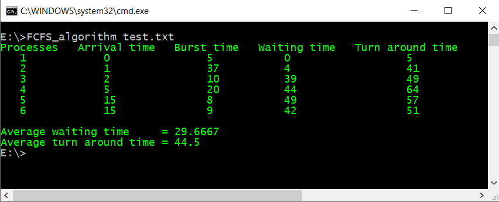

# [FCFS Scheduling algorithm](https://en.wikipedia.org/wiki/Scheduling_(computing)#First_come,_first_served)
The code simulates FCFS process time Scheduling algorithm.
>Note: It is properly compiled by Visual Studio 2015  


Usage guide
---
Compile it -> Run CMD -> Go to program directory -> Execute following command

```> FCFS_algorithm path/to/processes/file.txt ``` 
> Tip: "FCFS_algorithm"  is the name of the executable project file. if you compile it with a different name you shall replace it with your own executable file name. :)
***
Result
---

 